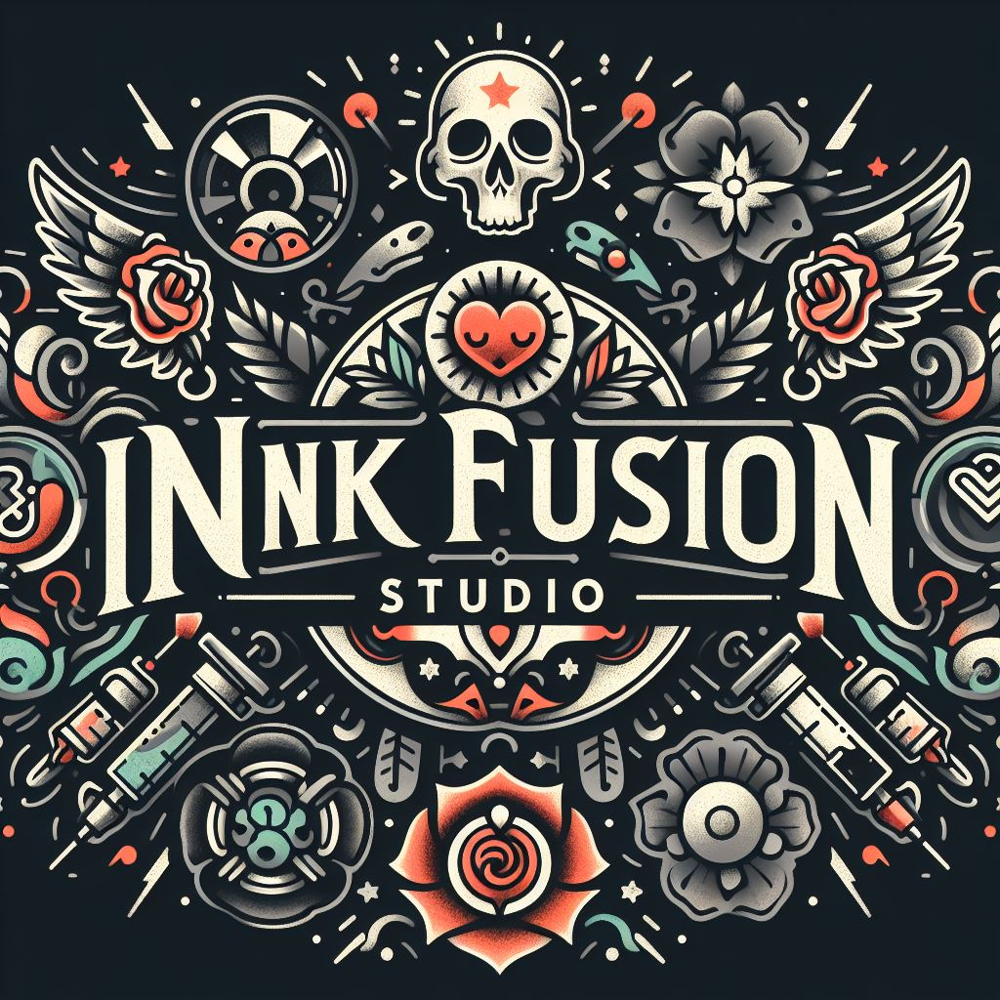
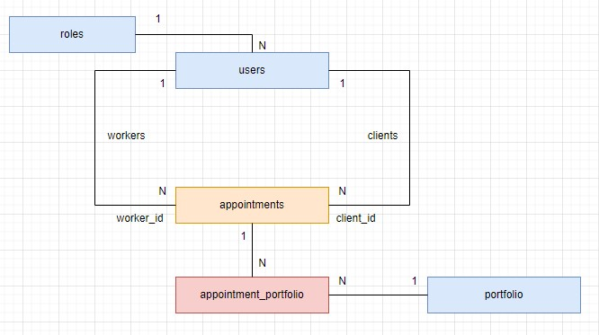

<p>
   <div align="center">
      
   </div>    
</p>
<p align="center">☠✒Backend de un estudio de tatuajes✒☠
<br>
Proyecto del Bootcamp de Full Stack Developer de Geekshubs Academy.</p>


**Innk Fusion Studio** es un proyecto que recrea el backend de un estudio de tatuajes utilizando node.js, typescript, typeOrm, express, mySQL, GIT , GitHub. Incluye una base de datos relacional y diferentes endpoints que te permiten registrarte, hacer login, acceder a la información de las tablas, e incluso actualizarla y borrarla.

## 📋 Contenido 

<details>

  <summary>Contenido</summary>
<ol>
    <li><a href="#objetivo">Objetivo</a></li>
    <li><a href="#tecnologías-utilizadas">Tecnologías Utilizadas</a></li>
    <li><a href="#diagrama-bd">Diagrama BD</a></li>
    <li><a href="#instrucciones-de-uso">Instrucciones de Uso</a></li>
    <li><a href="#endpoints">Endpoints</a></li>
    <li><a href="#futuras-modificaciones">Futuras Modificaciones</a></li>
    <li><a href="#contribuciones">Contribuciones</a></li>
    <li><a href="#licencia">Licencia</a></li>
</ol>

</details>

## Objetivo

🎯 Para hacer este proyecto se requería una API funcional conectada a una base de datos. Hice este plantemiento incial. 🎯 

<p>
   <div align="center">
      
   </div>    
</p>

## Tecnologías Utilizadas

<details>
<summary>🛠 Tecnologías 🛠</summary>

<div align="center">

   <a href="https://www.expressjs.com/">
      
   </a>
   <a href="https://nodejs.org/en">
      
   </a>
   <a href="https://developer.mozilla.org/es/docs/Web/JavaScript">
      
   </a>
   <a href="https://www.typescriptlang.org/">
      
   </a>

</div>

</details>

## Diagrama BD

Para empezar tenemos una tabla de "roles" relacionada con otra de "users". Establecemos que solo hay un rol por usuario y que en la tabla de usuarios se almacenan tanto clientes como trabajadores. Seguimos con la tabla de citas(appointments) que es la que une un cliente con un trabajador para conformar una cita relacionada con el portfolio del estudio mediante una tabla intermedia. 🏗

<p>
   <div align="center">
      
   </div>    
</p>

## Instrucciones de Uso

<details>
<summary>⚙🔧 Instrucciones 🔧⚙</summary>

1. Clona este repositorio con el siguiente comando: `git clone [URL del repositorio]`.
2. A continuación instala todas las dependencias: `npm install `
3. Conectamos nuestro repositorio con la base de datos mediante las variables de entorno que se encuentran en el archivo .env

    ``` js
         DB_HOST=
         DB_PORT=
         DB_USER=
         DB_PASSWORD=
         DB_DATABASE=  

          
         JWT_SECRET= ""
    ```  

4. Ejecutamos las migraciones `npx typeorm-ts-node-commonjs migration:run -d ./src/db.ts`
5. Para rellenar la tabla de datos inventados en el momento de desarrollo se puede hacer de dos maneras, una manualmente y dos con los factories, seeders y la librería faker. `npx ts-node ./src/database/seeders/dbSeeder.ts`
6. En desarrollo, lo hacemos funcionar y actualizarse en tiempo real mediante con este comando `npm run dev`
7. Para compilar usamos `npm run build`
8. En producción, con el comando `npm run start`
9. Usamos los endpoints almacenados en la carpeta routes para testear las distintas funcionalidades que se han diseñado.

</details>

## Endpoints

<details>
<summary>🧶Endpoints🧶</summary>

- ✅AUTHENTICATION

   - 🚛REGISTER USER

         POST http://localhost:4000/api/auth/register
      body:
      ``` js
            {
               "firstName":"newUser",
	            "email":"user@new.com",
	            "password":"12345678"
            }
      ```

   - 🚛LOGIN USER

         POST http://localhost:4000/api/auth/login
      body:
      ``` js
            {
               "email":"user@new.com",
	            "password":"12345678"
            }
      ```
- 👨‍👨‍👧‍👧USERS

   - 🚛PROFILE USER (Introducir token para la identificación(Auth))

      GET http://localhost:4000/api/users/profile
   
   - 🚛UPDATE PROFILE (Introducir token para la identificación(Auth))

         PUT http://localhost:4000/api/users/profile
      body:
        ``` js
        {
            "firstName": "NewUser", 
            "password": "Aa1234@",
        }
        ```
   - 🚛GET WORKERS (Introducir token para la identificación(Auth))

      GET http://localhost:4000/api/users/workers

- 📘APPOINTMENTS

   - 🚛CREATE APPOINTMENT (Introducir token para la identificación(Auth))
      
         POST http://localhost:4000/api/appointments
      body:
      ``` js
        {
            "appointment_date":"2024-03-19",
	         "email":"tattooWorker7@worker.com",
	         "name":"tattoName"
        }
      ```

   - 🚛UPDATE APPOINTMENT DATE (Introducir token para la identificación(Auth))

         PUT http://localhost:4000/api/appointments/:id
      body:
      ``` js
        {
            "AppointmentDate":"2024-04-12"
        }
      ``` 

   - 🚛DELETE APPOINTMENT (Introducir token para la identificación(Auth))

         DELETE http://localhost:4000/api/appointments/:id
      
   - 🚛GET CLIENT APPOINTMENTS (Introducir token para la identificación(Auth))

         GET http://localhost:4000/api/appointments/client/

   - 🚛GET WORKER APPOINTMENTS (Introducir token para la identificación(Auth))

         GET http://localhost:4000/api/appointments/worker/
      
</details>

## Futuras Modificaciones

🚀 Mejorar el CRUD de "appointments" trabajando no solo con la fecha si no con las horas en las que supuestamente estaría abierto el estudio.

🚀 Añadir CRUD para Portfolio

## Contribuciones
Si alguien desea contribuir en el desarrollo de este backend, puede ponerse en contacto con nosotros en richardsgadea@gmail.com o le invitamos a abrir un [Issue](https://github.com/RichardSGadea/InnkFusionStudio/issues) o enviar una [Pull request](https://github.com/RichardSGadea/InnkFusionStudio/pulls)

## Licencia

⚖️ Proyecto bajo la Licencia MIT.  `LICENSE` 
